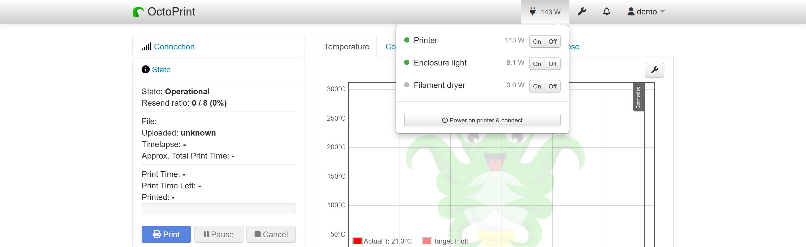
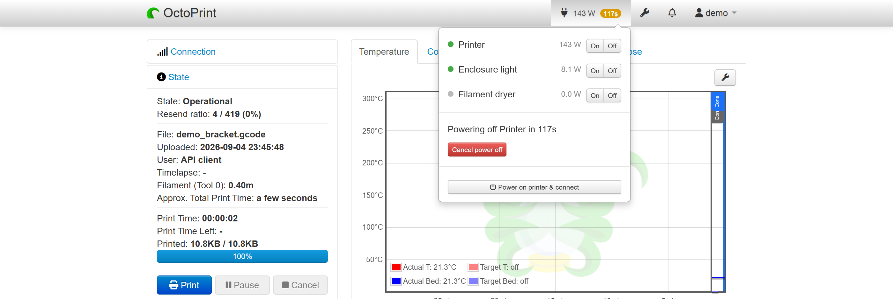
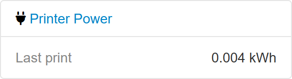
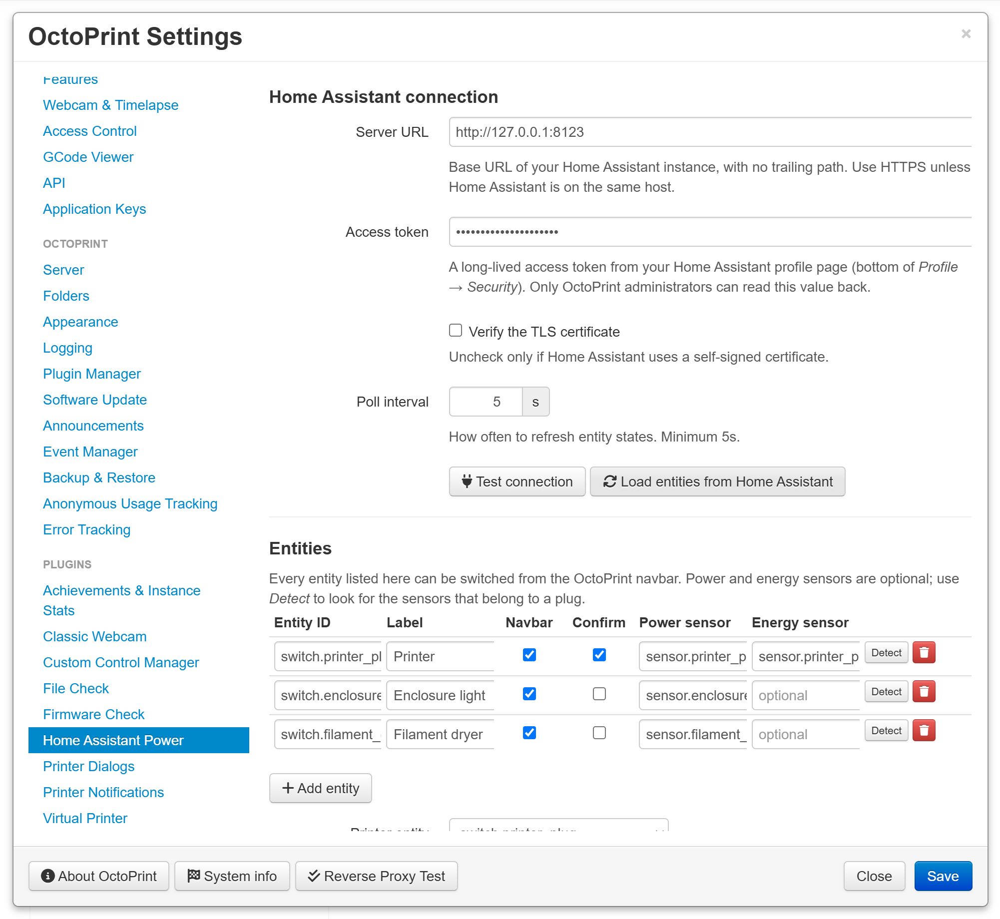

# OctoPrint-HomeAssistantPower

Control your Home Assistant smart plugs from inside OctoPrint.

Add any number of Home Assistant entities to a dropdown in the OctoPrint
navbar, cut power to the printer once a finished print has cooled down, and see
how much electricity each print used.

If you already own smart plugs and run Home Assistant, this removes the last
reason to leave the OctoPrint tab.

## Features

- **Multi-plug navbar control.** Every configured entity gets a state dot and
  on/off buttons in a navbar dropdown. Printer, enclosure light, filament
  dryer, whatever you have.
- **Power off after a print.** When a print finishes, a cancellable countdown
  appears; when it expires the plugin waits for the hotend (and optionally the
  bed) to drop below a temperature you choose, disconnects, and cuts power.
  Nothing is switched while the printer is still hot with its fans dead.
- **Power on and connect.** One button turns the printer plug on and retries the
  serial connection until the printer answers.
- **Energy and cost.** If your plugs report power and energy, the printer's live
  draw sits in the navbar itself where you can read it at a glance, each plug
  shows its own draw in the dropdown, and a sidebar panel reports what the
  current print has used so far, what the last one used, and optionally what it
  cost.
- **Any entity type.** The service domain is taken from the entity ID, so
  `switch.*`, `light.*` and `input_boolean.*` all work. That matters for Zigbee
  plugs, which land in different domains depending on whether you use ZHA,
  Zigbee2MQTT or a vendor integration.
- **Safe by default.** Powering off the printer entity mid-print requires an
  explicit confirmation, plug control is a separate OctoPrint permission, and
  the access token is only ever readable by administrators.

## Screenshots

The printer's live draw sits in the navbar itself; the dropdown gives every
configured entity a state dot, its own draw and on/off buttons:



After a print, a cancellable countdown runs before the printer is powered off:



The sidebar panel reports what each print consumed:



Entities, automation and energy options all live in one settings pane:



## Requirements

- OctoPrint 1.5.0 or newer
- A reachable Home Assistant instance
- A [long-lived access token](https://www.home-assistant.io/docs/authentication/#your-account-profile)
  from your Home Assistant profile page

No extra Python packages are installed: the plugin only uses `requests`, which
OctoPrint already ships.

## Installation

Install via the bundled [Plugin Manager](https://docs.octoprint.org/en/master/bundledplugins/pluginmanager.html)
or manually using this URL:

```
https://github.com/willtheorangeguy/OctoPrint-HomeAssistantPower/archive/v0.1.2.zip
```

## Setup

1. In Home Assistant, open your profile, scroll to **Long-lived access tokens**
   and create one. Copy it — it is only shown once.
2. In OctoPrint, go to **Settings → Home Assistant Power** and fill in the
   server URL and the token, then press **Test connection**.
3. Press **Load entities from Home Assistant** so the entity fields offer
   autocompletion.
4. Press **Add entity** for each plug you want to control. Give it a label; that
   is what appears in the navbar.
5. If your plugs report consumption, press **Detect** on a row to fill in its
   power and energy sensors. Not every plug has them — IKEA's TRETAKT does not,
   INSPELNING does. Without them everything else still works; the energy panel
   simply stays hidden.
6. Choose the **printer entity**. The automation and the energy panel apply to
   this one entity.
7. Turn on **Power off after a print** and set the cancel window and cooldown
   temperature to taste.

## How the post-print power-off works

```
print ends
  ↓
cancel window (default 60s)      ← cancel from the navbar or the notification
  ↓
wait for the hotend to cool below the threshold (capped by a timeout)
  ↓
disconnect from the printer
  ↓
turn the plug off
```

The sequence aborts by itself if a new print starts while it is waiting.

Set the cooldown temperature to 0 to skip the cooldown wait entirely.

## Why not auto-power-on?

OctoPrint cannot start a print while the printer is disconnected, so there is no
event to hang "power on before printing" from. Instead the navbar has a **Power
on printer & connect** button that switches the plug and then retries the serial
connection until the printer has booted.

## Permissions

The plugin registers a `CONTROL` permission (shown as *Control Home Assistant
plugs*), granted to the Admins and Users groups by default. Remove it from a
group to give someone read-only access to OctoPrint's status without letting
them switch your printer off.

Reading and changing the connection settings requires the standard OctoPrint
settings permission.

## Development

```bash
python -m venv .venv
.venv/bin/pip install OctoPrint
.venv/bin/pip install -e ".[develop]"
.venv/bin/pytest
```

Enable OctoPrint's *Virtual Printer* plugin to exercise the print-lifecycle
automation without hardware.

## Known limitations

- Entity states are polled (default every 30s) rather than pushed. Home
  Assistant's WebSocket API would be nicer and is the obvious next step.
- Per-print energy needs a cumulative energy sensor
  (`state_class: total_increasing`). A plain instantaneous power sensor gives
  you the live wattage but no per-print totals.

## License

[AGPLv3](LICENSE)
