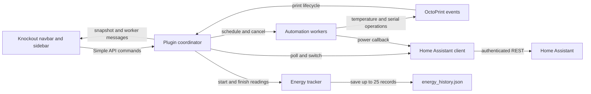

# Architecture

The plugin coordinates OctoPrint events, a Home Assistant HTTP client, worker-thread automation, and a Knockout browser view model.

## Overview

The server owns credentials and Home Assistant requests. The browser sends plugin commands and receives status messages through OctoPrint.



## Components

### Plugin coordinator

`octoprint_homeassistant_power/__init__.py` implements OctoPrint's settings, assets, templates, Simple API, event, startup, and shutdown mixins. It normalizes entity rows, creates the HTTP client, maintains the state cache, and applies permissions. It creates both automation controllers and the energy tracker after startup.

### Home Assistant client

`ha_client.py` uses a `requests.Session` with bearer authentication. A lock serializes session requests. The client trims the base URL, maps service domains, and turns request failures into `HomeAssistantError` messages. Periodic polling uses one `/api/states` request for all controls and linked sensors.

### Automation workers

`automation.py` contains `AutoOffController` and `PowerOnController`. They run daemon threads so countdowns and serial retry waits do not block an API request. Auto-off uses a `threading.Event` to interrupt waits and publishes phase snapshots. Power-on reports connection progress through messages.

### Energy tracker

`energy.py` normalizes sensor units, guesses sensor links, and subtracts fresh cumulative readings around each print. It persists completed records as JSON. Active measurements stay in memory. The browser applies the current electricity rate when displaying cost.

### Browser view model

`static/js/homeassistant_power.js` binds the Jinja templates through Knockout. It maintains observable state, handles confirmations and notifications, and formats watts, kWh, and cost. OctoPrint's plugin-message channel updates the UI without a separate Home Assistant connection in the browser.

## Data flow

For example, a `turn_on` command for `switch.printer_plug` checks plug-control permission and the saved entity list, calls `switch.turn_on`, and returns `{"ok": true}`. A timer schedules a state poll after about 1.5 seconds. A changed normalized snapshot is then sent with `type: states`.

A regular poll runs immediately after startup or settings save, then at the configured interval. Home Assistant failures clear the cache and expose an error. Print start and end events bypass that cache for energy boundary readings. Print-end outcomes separately decide whether to schedule auto-off.

## Directory layout

```text
octoprint_homeassistant_power/
  __init__.py       OctoPrint integration, settings, API, polling, events
  ha_client.py      Home Assistant REST transport and error mapping
  automation.py     Power-off and power-on worker controllers
  energy.py         Sensor parsing, discovery, and print history
  templates/       Settings, navbar, and sidebar templates
  static/          Browser JavaScript and CSS
tests/             HTTP mocks, automation fakes, and energy tests
docs/              MkDocs content and existing screenshots
scripts/           Deployment helper and documentation preview scripts
.github/workflows/ Plugin tests and shared documentation workflow callers
setup.py           Plugin metadata and packaging
mkdocs.yml         Shared theme inheritance and site navigation
```

## Design boundaries

There is no Home Assistant WebSocket subscription, standalone command-line interface, or database. The selected printer entity is the boundary for automation and print energy. See [Roadmap](roadmap.md) for current limitations and [Python reference](python-reference.md) for source-derived interfaces.
