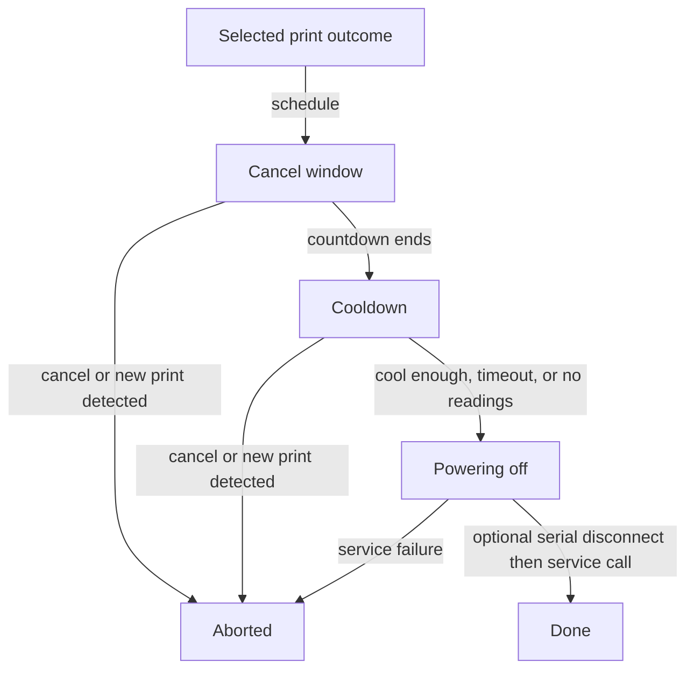

# Usage

Use the navbar for switching and the **Printer Power** sidebar for consumption. Automation and per-print measurement apply to the one selected **Printer entity**.

## Switch an entity

Open the navbar dropdown and use the on/off buttons beside a configured label. For example, the row labeled `Printer` can control `switch.printer_plug` while another row controls an enclosure light. A successful command schedules a state refresh about 1.5 seconds later. Changes made directly in Home Assistant appear on the next regular poll.

The **Confirm** checkbox requests browser confirmation before switching an entity shown as on. Separately, the server refuses an unforced printer `turn_off` while `is_printing()` is true and asks the UI for confirmation. This server check does not cover the paused state. See [API](api.md) before implementing a separate client.

Manual off commands do not run the cooldown sequence.

## Power on and connect

Press **Power on printer & connect** in the navbar. The plugin switches the printer entity on, then retries the serial connection for 30 seconds by default. Set **Connect timeout** higher if the controller needs longer to boot. Disable **Connect to the printer after powering it on** to send only the switching request.

This is an explicit action. The plugin does not power on automatically when a print is queued. A successful API response means the worker started; connection success or timeout arrives afterward as a plugin message.

## Post-print power off

Enable **Turn the printer entity off when a print ends** in Settings. Select **Completed**, **Failed**, and/or **Cancelled**. Only **Completed** is selected by default.

The controller moves through the following phases. Cancellation and print-state checks operate while it is waiting.

1. **Cancel window:** a countdown runs for 60 seconds by default. Cancel from the navbar or notification.
2. **Cooldown:** every five seconds, check the hottest reported `tool*` temperature and optionally the bed. Proceed when the hottest tracked reading is at or below the threshold, 40 °C by default.
3. **Powering off:** optionally disconnect serial, wait one second, then call Home Assistant's off service.

!!! warning "Timeout and missing readings allow power-off"
    After the default 900-second cooldown timeout, power is cut even above the selected temperature. No usable temperature readings also allow immediate progress. A cooldown temperature of `0` skips the temperature wait. A cooldown timeout of `0` removes the time limit while readings remain available.

A new `PrintStarted` event requests cancellation, and wait loops also check for printing or paused states. Cancellation is not a guaranteed last-moment interlock once power-off begins: the final switching method does not recheck the cancel flag or printer state. Leave a usable cancel window and cancel before switching starts.

## Read energy and cost

With linked sensors, the printer's live watts appear in the navbar and each entity's watts appear in the dropdown. The sidebar shows current or last-print energy and optional cost.

For example, an energy meter increase from 18.41 kWh to 18.66 kWh records 0.25 kWh. At a configured rate of 0.15 per kWh, the calculated cost is 0.0375 in the chosen currency before display rounding. See [Energy tracking](energy.md) for meter requirements and persistence.

## Change settings

Add entities, detect sensors, select the printer, and configure automation in one pane. **Detect** guesses sensors by name; verify the selected IDs before saving.

